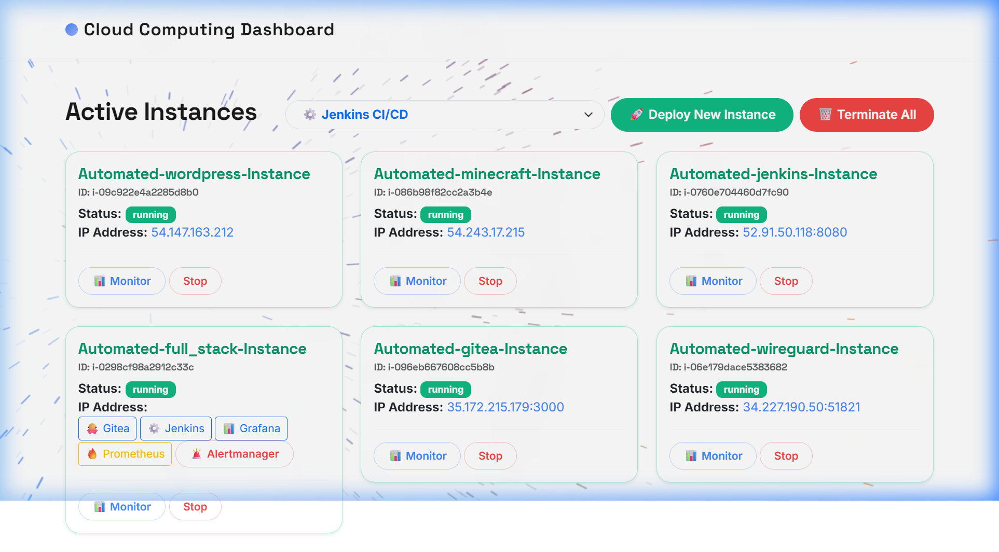
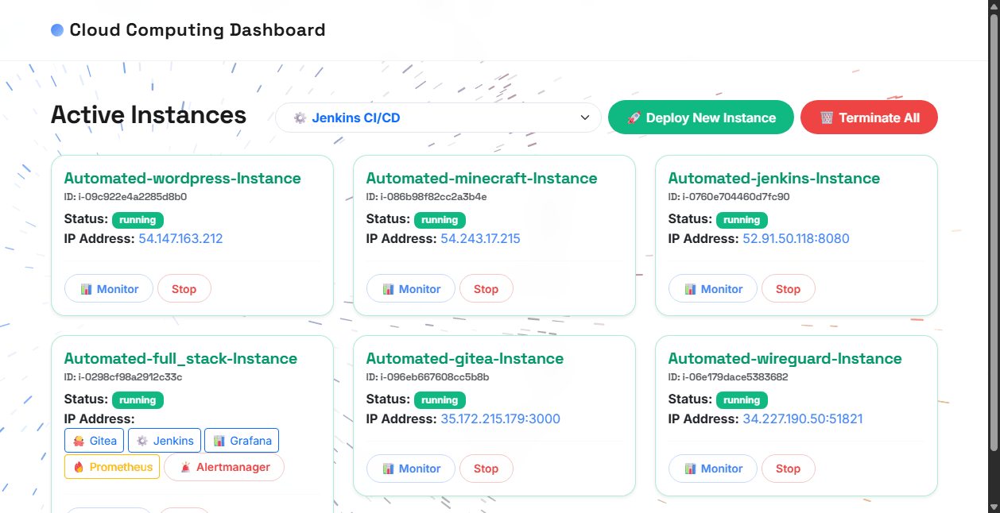
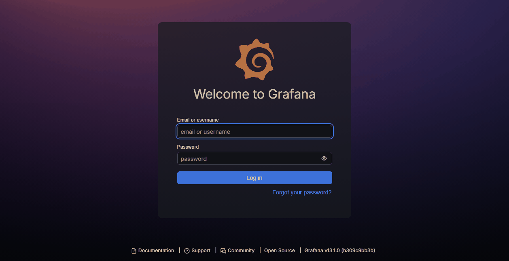
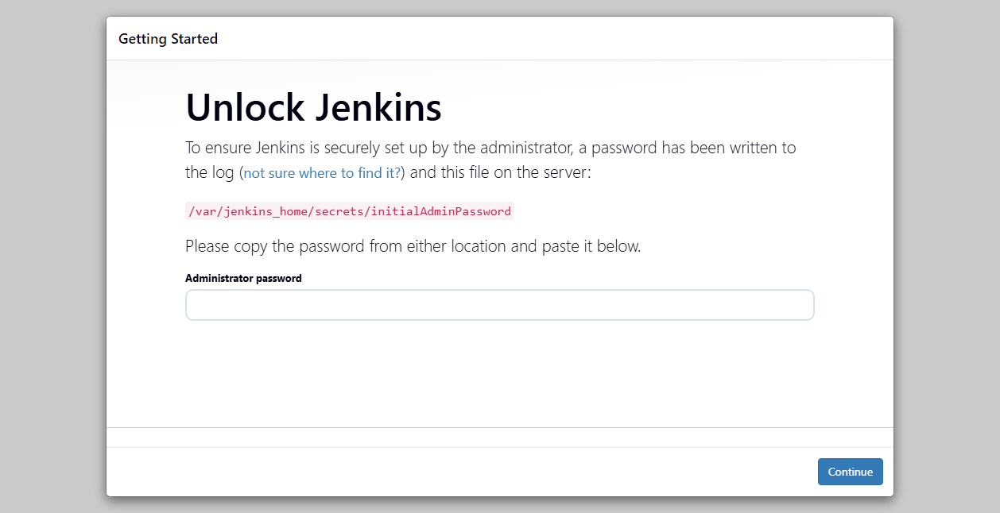
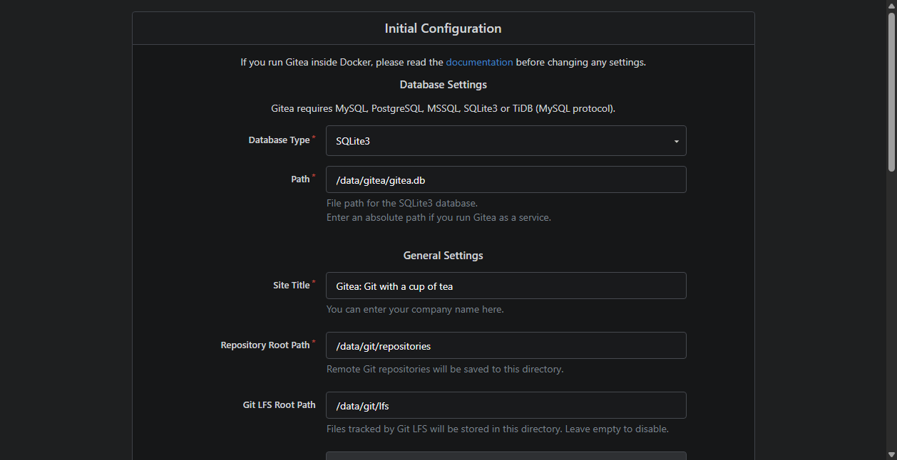
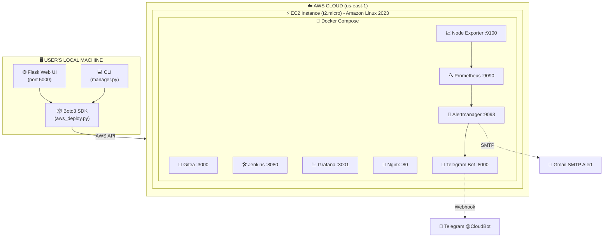
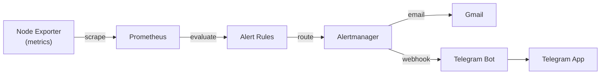

# ☁️ Automated Deployment and Monitoring of Cloud Instances

<div align="center">


**An enterprise-grade cloud infrastructure platform that automates deployment, monitoring, and alerting of AWS EC2 instances with a single click.**

[Features](#-features) • [Architecture](#-architecture) • [Quick Start](#-quick-start) • [Usage](#-usage) • [Monitoring & Alerting](#-monitoring--alerting) • [Terraform IaC](#-infrastructure-as-code-terraform)

<br>



**Live CloudWatch Monitoring & Dashboard:**


</div>

---

## 📋 Table of Contents

- [Features](#-features)
- [Architecture](#-architecture)
- [Tech Stack](#-tech-stack)
- [Project Structure](#-project-structure)
- [Prerequisites](#-prerequisites)
- [Quick Start](#-quick-start)
- [Usage](#-usage)
  - [Web Dashboard](#-web-dashboard-recommended)
  - [Command Line Interface](#-command-line-interface-cli)
  - [REST API](#-rest-api)
- [Performance Metrics](#-performance-metrics)
- [Deployment Templates](#-deployment-templates)
- [Enterprise Full Stack](#-enterprise-full-stack)
- [Monitoring & Alerting](#-monitoring--alerting)
- [Infrastructure as Code (Terraform)](#-infrastructure-as-code-terraform)
- [Security Considerations](#-security-considerations)
- [Cloud Cost Optimization](#-cloud-cost-optimization)
- [Future Roadmap](#-future-roadmap)
- [Troubleshooting](#-troubleshooting)
- [Author](#-author)

---

## ✨ Features

| Feature | Description |
|---------|-------------|
| 🖥️ **Web Dashboard** | Beautiful Flask-based GUI to deploy, monitor, and terminate instances |
| 🚀 **One-Click Deployments** | 6 pre-configured templates (Jenkins, Gitea, WordPress, WireGuard, Minecraft, Full Stack) |
| 📊 **Real-Time Monitoring** | Prometheus + Grafana for CPU, Memory, Disk, and Network metrics |
| 🚨 **Smart Alerting** | Alertmanager with Email (Gmail) and Telegram notifications |
| 🏗️ **Infrastructure as Code** | Terraform templates to provision the entire stack automatically |
| 🔐 **VPN Support** | WireGuard VPN deployment for secure remote access |
| 🐳 **Containerized Services** | Docker Compose orchestration for the entire enterprise stack |
| 💻 **CLI Support** | Full command-line interface for scripting and automation |

---

## 📸 Services Showcase

| Grafana Analytics | Jenkins CI/CD | Gitea Repository |
|:---:|:---:|:---:|
|  |  |  |

---

## 🏗️ Architecture



### Alert Flow



---

## 🛠️ Tech Stack

| Layer | Technology | Purpose |
|-------|-----------|---------|
| **Frontend** | Flask + Bootstrap 5 | Web Dashboard UI |
| **Backend** | Python 3.8+ / Boto3 | AWS API interaction |
| **Cloud** | AWS EC2 | Compute infrastructure |
| **Containerization** | Docker + Docker Compose | Service orchestration |
| **CI/CD** | Jenkins | Continuous Integration |
| **Version Control** | Gitea | Self-hosted Git service |
| **Monitoring** | Prometheus + Node Exporter | Metrics collection |
| **Visualization** | Grafana | Dashboards & graphs |
| **Alerting** | Alertmanager | Alert routing & notifications |
| **Notifications** | Gmail SMTP + Telegram Bot | Multi-channel alerts |
| **VPN** | WireGuard (wg-easy) | Secure remote access |
| **IaC** | Terraform | Infrastructure provisioning |
| **Reverse Proxy** | Nginx | Traffic routing |

---

## 📁 Project Structure

```
cloud_computing_project/
│
├── app.py                  # Flask web application (main entry point)
├── aws_deploy.py           # EC2 deployment logic with user_data scripts
├── aws_monitor.py          # CloudWatch monitoring integration
├── manager.py              # CLI interface for managing instances
├── terminate.py            # Instance termination logic
├── config.py               # Configuration (AWS region, AMI, instance type)
├── push_hash.py            # Git commit hash tracking
│
├── templates/
│   └── index.html          # Web Dashboard UI template
│
├── terraform/              # Infrastructure as Code
│   ├── main.tf             # Main Terraform configuration
│   ├── variables.tf        # Input variables
│   └── outputs.tf          # Output values (URLs, IPs)
│
├── requirements.txt        # Python dependencies
├── .env.example            # Environment variables template
├── .env                    # Your AWS credentials (git-ignored)
└── cloud_computing_key.pem # SSH key pair (auto-generated)
```

---

## 📦 Prerequisites

| Requirement | Version | Purpose |
|-------------|---------|---------|
| Python | 3.8+ | Runtime |
| pip | Latest | Package manager |
| AWS Account | — | Cloud provider |
| AWS IAM Credentials | — | API access (EC2, CloudWatch) |
| Terraform | 1.0+ | *(Optional)* Infrastructure as Code |

---

## 🚀 Quick Start

### 1. Clone the Repository

```bash
git clone https://github.com/your-username/cloud_computing_project.git
cd cloud_computing_project
```

### 2. Install Dependencies

```bash
pip install -r requirements.txt
```

### 3. Configure AWS Credentials

```bash
copy .env.example .env
```

Edit `.env` and fill in your AWS credentials:

```env
AWS_ACCESS_KEY_ID=your_access_key_here
AWS_SECRET_ACCESS_KEY=your_secret_key_here
AWS_REGION=us-east-1
```

> ⚠️ **Important:** The default AMI is configured for `us-east-1`. If you change the region, update the `AMI_ID` in `config.py`.

### 4. Launch the Dashboard

```bash
python app.py
```

Open your browser at **http://127.0.0.1:5000** 🎉

---

## ⚡ Performance Metrics

| Metric | Benchmark |
|--------|-----------|
| **Infrastructure Provisioning** | `< 2 minutes` (via Terraform/Boto3) |
| **Docker Compose Stack Boot** | `< 60 seconds` (All 8 containers) |
| **Alert Trigger to Notification** | `< 5 seconds` (Webhook to Telegram) |
| **Dashboard Response Time** | `< 100ms` (Flask backend) |

---

## 📖 Usage

### 🖥️ Web Dashboard (Recommended)

The web dashboard provides a visual interface to manage your cloud infrastructure:

1. **Start the server:** `python app.py`
2. **Open:** `http://127.0.0.1:5000`
3. **Deploy:** Select a template and click "Deploy"
4. **Monitor:** Click "📊 Monitor" on any running instance
5. **Terminate:** Click "Stop" to terminate instances

### 💻 Command Line Interface (CLI)

For terminal users and scripting:

```bash
# Deploy an instance (default: Jenkins)
python manager.py deploy

# Deploy a specific template
python manager.py deploy --template full_stack

# List all instances
python manager.py list

# Monitor an instance
python manager.py monitor <instance_id>

# Terminate a specific instance
python manager.py terminate <instance_id>

# Terminate ALL project instances
python manager.py terminate all
```

### 🔌 REST API

The Flask application exposes REST endpoints for programmatic access:

| Method | Endpoint | Description |
|--------|----------|-------------|
| `GET` | `/` | Renders the main dashboard |
| `POST` | `/deploy` | Deploys a new EC2 instance (Payload: `template` ID) |
| `POST` | `/terminate` | Terminates instances (Payload: `instance_id` or `all`) |
| `POST` | `/alert` | Webhook endpoint for Alertmanager to trigger Telegram bot |

---

## 📦 Deployment Templates

| Template | Services Included | Port(s) | Use Case |
|----------|------------------|---------|----------|
| **Jenkins** | Jenkins CI/CD | 8080 | Continuous Integration server |
| **Gitea** | Gitea Git Server | 3000 | Self-hosted GitHub alternative |
| **WordPress** | Apache + MariaDB + PHP + WordPress | 80 | Blog / CMS |
| **WireGuard** | WireGuard VPN (wg-easy) | 51820/udp, 51821 | Secure VPN tunnel |
| **Minecraft** | Minecraft Java Server | 25565 | Game server |
| **Full Stack** | All enterprise services (see below) | Multiple | Production environment |

---

## 🏢 Enterprise Full Stack

The **Full Stack** template deploys a complete enterprise DevOps environment on a single EC2 instance using Docker Compose:

| Service | Port | Description |
|---------|------|-------------|
| **Gitea** | 3000 | Self-hosted Git repository |
| **Jenkins** | 8080 | CI/CD automation server |
| **Grafana** | 3001 | Monitoring dashboards |
| **Prometheus** | 9090 | Metrics collection engine |
| **Alertmanager** | 9093 | Alert routing & notifications |
| **Node Exporter** | 9100 | System metrics exporter |
| **Nginx** | 80 | Reverse proxy |
| **Telegram Bot** | 8000 | Alert forwarding to Telegram |

### Default Credentials

| Service | Username | Password |
|---------|----------|----------|
| Grafana | `admin` | `admin` (change on first login) |
| Jenkins | `admin` | Auto-generated (check logs: `docker logs fullstack-jenkins-1`) |
| Gitea | — | Register on first visit |

---

## 🚨 Monitoring & Alerting

### Prometheus Alert Rules

The system automatically monitors for the following conditions:

| Alert | Condition | Severity | Trigger Time |
|-------|-----------|----------|--------------|
| **InstanceDown** | Any service stops responding | 🔴 Critical | 1 minute |
| **HighCpuUsage** | CPU usage > 80% | 🟡 Warning | 2 minutes |
| **HighMemoryUsage** | Memory usage > 80% | 🟡 Warning | 2 minutes |
| **HighDiskUsage** | Disk usage > 85% | 🟡 Warning | 5 minutes |

### Notification Channels

| Channel | Method | Details |
|---------|--------|---------|
| 📧 **Email** | Gmail SMTP | Sends HTML-formatted alerts via Google App Password |
| 📱 **Telegram** | Bot API Webhook | Custom Python bot forwards alerts to your Telegram |

### Alert Lifecycle

1. **PENDING** → Condition detected, waiting for threshold duration
2. **FIRING** → Alert sent to all notification channels
3. **RESOLVED** → Condition cleared, resolution notification sent

---

## 🏗️ Infrastructure as Code (Terraform)

The `terraform/` directory contains IaC templates to provision the entire infrastructure automatically:

```bash
cd terraform/

# Initialize Terraform
terraform init

# Preview changes
terraform plan

# Apply infrastructure
terraform apply

# Destroy infrastructure
terraform destroy
```

### Terraform Resources

| Resource | Description |
|----------|-------------|
| `aws_instance.full_stack` | EC2 instance with Docker + Full Stack |
| `aws_security_group` | Firewall rules for all service ports |
| `aws_key_pair` | SSH key pair for instance access |

### Terraform Outputs

| Output | Description |
|--------|-------------|
| `public_ip` | EC2 instance public IP address |
| `gitea_url` | Direct URL to Gitea |
| `jenkins_url` | Direct URL to Jenkins |
| `grafana_url` | Direct URL to Grafana |
| `alertmanager_url` | Direct URL to Alertmanager |

---

## 🔐 Security Considerations

- **AWS Credentials:** Stored in `.env` file (git-ignored). Never commit credentials.
- **App Passwords:** Gmail App Passwords are used instead of regular passwords.
- **SSH Keys:** Auto-generated `.pem` file with restricted permissions (`chmod 400`).
- **Security Groups:** Only necessary ports are opened (22, 80, 3000, 3001, 8080, 9090, 9093).
- **Docker Network:** Services communicate over an internal Docker bridge network.

---

## 💰 Cloud Cost Optimization

This project is designed with student/developer budgets in mind:

- **Free Tier Compatible:** Defaults to `t2.micro` instances which fall under the AWS 12-month Free Tier.
- **Auto-Termination:** Includes a "Terminate All" button to wipe the entire infrastructure instantly when not in use.
- **Resource Efficient:** Alpine Linux and optimized Docker images are used wherever possible to minimize EBS volume costs.
- **IaC Destroy:** A single `terraform destroy` command eradicates all NATs, IGWs, and EC2s to prevent lingering billing charges.

---

## 🚀 Future Roadmap

- [ ] **Multi-Cloud Support:** Abstract the AWS Boto3 logic to allow deployment to Google Cloud (GCP) and Azure.
- [ ] **Kubernetes Migration:** Upgrade the Docker Compose orchestration to a full k3s/Minikube cluster.
- [ ] **AI-Driven Alerts:** Integrate an LLM to analyze Grafana logs and suggest fixes when an alert fires.
- [ ] **CI/CD Dashboard Integration:** Surface Jenkins build statuses directly inside the Flask Web UI.

---

## 🔧 Troubleshooting

| Problem | Solution |
|---------|----------|
| **"This site can't be reached"** | Wait 2-3 minutes after deployment for Docker images to download |
| **"Unable to locate credentials"** | Check your `.env` file has valid AWS credentials |
| **Jenkins "Unlock"** | SSH in and run: `sudo docker logs fullstack-jenkins-1` to get the initial password |
| **Grafana login** | Default credentials: `admin` / `admin` |
| **No alert emails** | Verify Gmail App Password; check Alertmanager logs: `sudo docker logs fullstack-alertmanager-1` |
| **No Telegram alerts** | Ensure you sent `/start` to the bot first |

---

## 👨‍💻 Author

**Nitish Pattar**
MCA Student

---

## 📄 License

This project is licensed under the [Apache License 2.0](LICENSE).

**Copyright & Patent Rights © 2026 Nitish Pattar.** All rights reserved.

This project is developed as part of an MCA academic curriculum for the **Cloud Computing** course.

---

<div align="center">

**⭐ If this project helped you, give it a star! ⭐**

</div>
